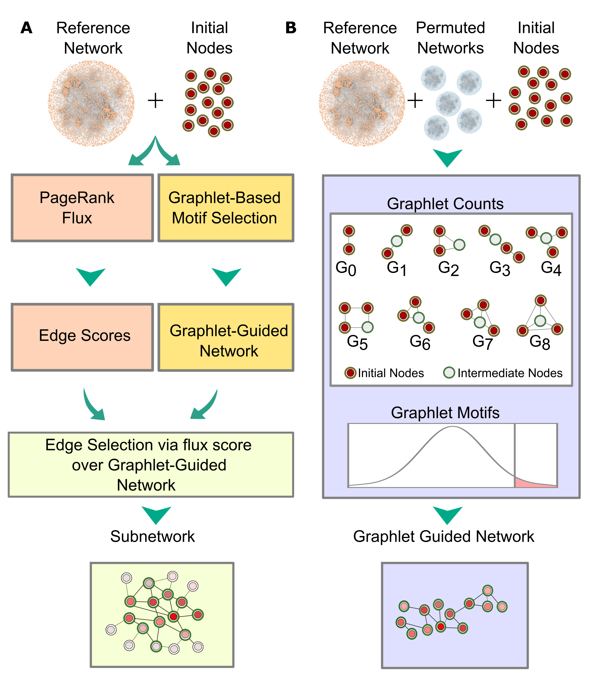
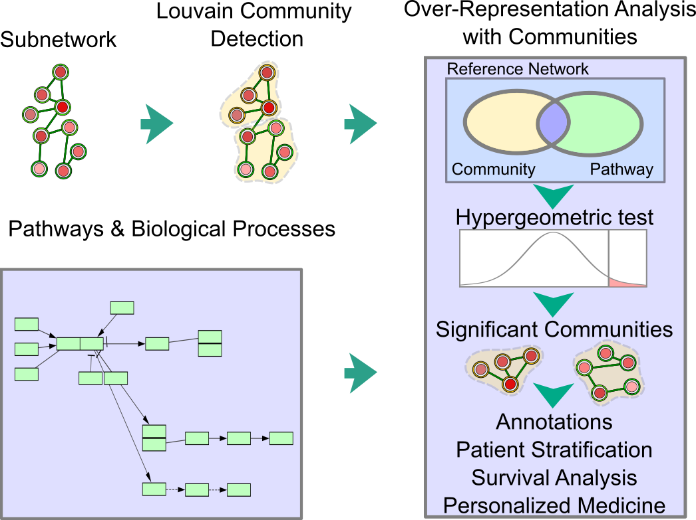

# PARAGON 

## Overview  

<font-weight="normal"> PARAGON (PAgeRAnk-flux on Graphlet-guided network for multi-Omic data integratioN) is a novel method that infers a context specific subnetwork from a given reference network, utilizing omic-hits as a initial node set and then identifies significant modules in specific subnetworks. During network inference, PARAGON run in three steps:  i. Graphlet-guided network (GGN) construction, ii. Propagation via  Personalized PageRank (PPR) algorithm, iii. Edge scoring and selection via flux calculation (Figure 1A).  
 

    

<\p >
                                                           

<font-weight="normal">Figure 1:</font-weight> Conceptual view of network inference in PARAGON 

                                        
                                        
                                        
                                        
                                        
                                                                         
 
 
 

Graphlet module of PARAGON identifies, an associated region of reference network through substantially frequent graphlets composed of 2-, 3-, and 4-nodes. Each graphlet includes an intermediate node that is the most interacting nodes in the graphlet. PARAGON collects the frequent graphlet motifs into GGN. In this way, PARAGON shrinks the size of the network into GGN and eliminates highly connected nodes and their unrelated interactions.  

Independent to the graphlet module, PARAGON propagates signals from omic-hits through the personalizaed PageRank algorithm in re-scoring all proteins in the reference. Then, flux calculation weights each edge of the GGN, considering PageRank scores of nodes, confidence scores of edges and the number of node interactions. Finally, PARAGON infer the context specific network by selecting the highly scored edges.  

 

 

<font-weight="normal"> <font-weight="bold">Figure 2:</font-weight> Conceptual view of community analysis in PARAGON 

PARAGON goes beyond network inference by dividing the network into functional units. Community analysis module recruites the louvain community detection method based on network topology. Then, PARAGON can identify significant modules by appying hypergeometric test for a given prior knowledge such as biological processes, pathways. 
   
                                       

                                    
## Installation from GIT

pip install git+https://github.com/metunetlab/pyPARAGON.git

                                       
                                       
                               

## Installation after downloading in linux command prompt

To get the last version of pyPARAGON, visit the GitHub repository: https://github.com/metunetlab/pyPARAGON

1. Create a virtual environment for pyPARAGON
python3 -m venv pyPARAGONenv

2. Activate the pyPARAGON Environment 
source venv/bin/activate

3. Install python package for in-house setup
pip install wheel
pip install setuptools

4. Go to pyPARAGON folder, the folder including setup.py and run setup.py as using
python setup.py bdist_wheel

5. The wheel file should be stored in the "dist" folder that should be written in the step 4. run the file extended with "whl" as using
pip install /path/to/wheelfile.whl 
                                       
                                       
## Citation <h2>      
    

Arici, M.K., Tuncbag, N. Discovering Hidden Connections in Omics Data: an Integrative Modeling Approach for Unveiling Cancer Networks, 2023, in submission 

