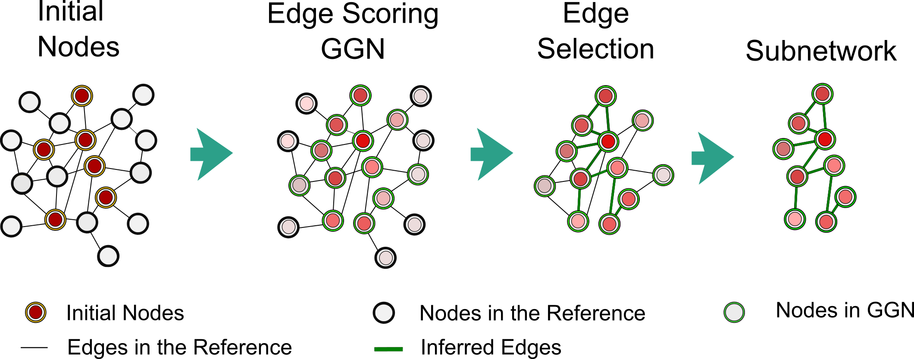

# pyPARAGON 

## Overview  

<font-weight="normal"> pyPARAGON (PAgeRAnk-flux on Graphlet-guided network for multi-Omic data integratioN) is a novel method that infers a context specific subnetwork from a given reference network, utilizing omic-hits as a seed node set and then identifies significant modules in specific subnetworks. During network inference, pyPARAGON run in three steps (Figure 1.A): 

 i. Graphlet-guided network (GGN) construction,

 ii. Propagation via  Personalized PageRank (PPR) algorithm, 

 iii. Edge scoring and selection via flux calculation.  
 

    

<strong>Figure 1:Conceptual view of network inference in pyPARAGON: (A)</strong> The network inference module of pyPARAGON operates in three main steps: i.) GGN construction; ii.) Edge scoring with personalized PageRank flux calculation on a given reference network; iii.) Subnetwork inference using edge scores and GGN. <strong>(B)</strong> We investigated nine non-isomorphic graphlets (G0-G8) composed of 2, 3, and 4 nodes for building GGN. Except for G0, each graphlet includes initial nodes (red circles) and a hidden node (white circles) in one of the highest degrees of orbits. To uncover motifs, we counted the graphlets in 100 permuted networks that had the same initial node set. Using the z-test, we compared the targeted graphlet count in the reference and permuted networks (p < 0.05, z-score > 1.65). The union of significant graphlets constructs GGN.  

 
 
 

Graphlet module of pyPARAGON identifies, an associated region of reference network through substantially frequent non-isomorphic graphlets composed of 2-, 3-, and 4-nodes (Figure 1.B). Each graphlet includes an intermediate node that is the most interacting nodes in the graphlet. pyPARAGON collects the frequent graphlet motifs into GGN. In this way, pyPARAGON shrinks the size of the network into GGN and eliminates highly connected nodes and their unrelated interactions.  

Independent to the graphlet module, pyPARAGON propagates signals from omic-hits through the personalizaed PageRank algorithm in re-scoring all proteins in the reference (Figure 2). Then, flux calculation weights each edge of the GGN, considering PageRank scores of nodes, confidence scores of edges and the number of node interactions. Finally, pyPARAGON infer the context specific network by selecting the highly scored edges.  

 

 

<strong>Figure 2: Edge Scoring and Selection in pyPARAGON:</strong> By random walking from weighted initial nodes in the reference network, the Personalized PageRank algorithm assigns a priority to each node. The computation of fluxes between interacting nodes scored edges in the reference. The highly weighted edges reported in GGN construct a subnetwork or specific network.  

pyPARAGON goes beyond network inference by dividing the network into functional units. Community analysis module recruites the louvain community detection method based on network topology (Figure 3). Then, pyPARAGON can identify significant modules by appying hypergeometric test for a given prior knowledge such as biological processes, pathways. 
     

 

 

<strong>Figure 3:Conceptual view of community analysis in pyPARAGON:</strong> The network analysis module of pyPARAGON employs Louvain community detection methods, based on network topology, to divide the inferred network into functional units. The communities are evaluated using prior knowledge such as components of biological processes and pathways. The communities are tested with hypergeometric tests to identify significantly overrepresented annotations. This integration of annotations and inferred subnetworks provides patient stratification, survival analysis, and personalized medicine. 

 pyPARAGON allows researchers to precisely integrate omics data through a reference network, composed of huge prior knowledge. Researchers may model topic of interest, such as diseases, drug trials in inferred context-specific networks. Additionally, independent to network inference module,  pyPARAGON determines the substantial communities of any network associated with the biological annotations for biological interpretations such as patient stratification, survival analysis and personalized medicine. 

## Installation from Git :

pip install git+https://github.com/metunetlab/pyPARAGON.git

                                       
                                       
                               

## Installation in linux command prompt after downloading :

#### 1. Create a virtual environment for pyPARAGON

python3 -m venv pyPARAGONenv

#### 2. Activate the pyPARAGON Environment 

source venv/bin/activate

#### 3. Install python package for in-house setup

pip install wheel

pip install setuptools

#### 4. Go to pyPARAGON folder, the folder including setup.py and run setup.py as using

python setup.py bdist_wheel

#### 5. The wheel file should be stored in the "dist" folder that should be written in the step 4. run the file extended with "whl" as using

pip install /path/to/wheelfile.whl 

## Citation

Arici, M.K., Tuncbag, N. Discovering Hidden Connections in Omics Data: an Integrative Modeling Approach for Unveiling Cancer Networks, 2023, in submission

